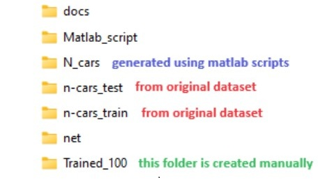

# A Methodology to Study the Impact of Spiking Neural Network Parameters Considering Event-Based Automotive Data

It is a novel methodology to systematically study and analyze the impact of SNN parameters considering event-based automotive data, then leverage this analysis for enhancing SNN developments. To do this, we first explore different settings of SNN parameters that directly affect the learning mechanism (i.e., batch size, learning rate, neuron threshold potential, and weight decay), then analyze the accuracy results. Afterward, we propose techniques that jointly improve SNN accuracy and reduce training time. Experimental results show that our methodology can improve the SNN models for AD systems than the state-of-the-art, as it achieves higher accuracy (i.e., 86%) for the N CARS dataset, and it can also achieve iso-accuracy (i.e., ~85% with standard deviation less than 0.5%) while speeding up the training time by 1.9x. In this manner, our research work provides a set of guidelines for SNN parameter enhancements, thereby enabling the practical developments of SNN-based AD systems.

## Create Conda Environment (if required): 
```
conda create --name SNNparams python=3.8
```

## Installation: 
Ensure to fulfill the library requirements:
```
pip install numpy torch torchvision
```

## Preparation: 
Prepare the working folders as shown like this figure. 
<p align="left"></p>

To do this, first prepare the original N-CARS dataset (n-cars_test & n-cars_train), which can be downloaded from this [link](https://www.prophesee.ai/2018/03/13/dataset-n-cars/).

Then, generate the modified dataset (N_cars) using matlab scripts, which will create the N_cars folder.   

Afterwards, create "Trained_100" folder and run the example below.

## Example of command to run the code:
```
CUDA_VISIBLE_DEVICES=0 python3 main.py --filenet ./net/net_attwindow_100x100.txt --fileresult res_attwindow_100x100 --batch_size 40 --lr 1e-3 --lr_decay_epoch 20 --lr_decay_value 0.5 --threshold 0.4 --att_window 100 100 0 0 --weight_decay 0
```

You can modify the investigated parameter (e.g., batch size, learning rate, thershold potential and weight decay) to see its impact on the accuracy.


## Citation
If you use this work in your research or find it useful, kindly cite the following [article](https://doi.org/10.1109/ICARCV63323.2024.10821503):
```
@INPROCEEDINGS{Ref_Bano_SNNParams_ICARCV24,
  author={Bano, Iqra and Wicaksana Putra, Rachmad Vidya and Marchisio, Alberto and Shafique, Muhammad},
  booktitle={2024 18th International Conference on Control, Automation, Robotics and Vision (ICARCV)}, 
  title={A Methodology to Study the Impact of Spiking Neural Network Parameters Considering Event-Based Automotive Data}, 
  year={2024},
  volume={},
  number={},
  pages={897-903},
  keywords={Training;Learning systems;Accuracy;Event detection;Neurons;Transportation;Spiking neural networks;Standards;Automotive engineering;Guidelines},
  doi={10.1109/ICARCV63323.2024.10821503}}

```

This work is inspired from the work of SNN4Agents: [paper](https://doi.org/10.3389/frobt.2024.1401677) & [code](https://github.com/rachmadvwp/SNN4Agents).
